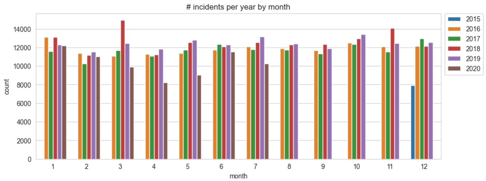

# Emergency Calls

Visualiztions in Python using Seaborn and Matplotlib to show important insighnts fro the data set Analysis of the dataset [Emergency 911 Calls by Montgomery County, PA](https://www.kaggle.com/datasets/mchirico/montcoalert) from Kaggle. 

 

**Project Planning**
1. Data Gathering
2. Data Cleaning and Data Wrangling
3. Data Analysis
4. Conclusions

 

By [Rodrigo Rosales Alvarez](https://www.linkedin.com/in/rodrigorosalesalvarez/)