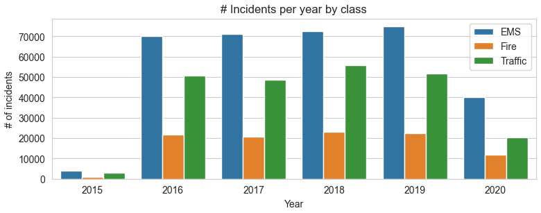

# Data Science Portfolio

### By **RODRIGO ROSALES ALVAREZ**

 

I have a strong background as a Data Analyst and some experience as a Data Engineer. Currently I am doing my Master´s in Data Science at the University of Calgary. I am very hard working, and I am always eager to learn new things. 

This is my Data Science Portfolio where I showcase my work as a Data Scientist/Data Analyst/Data Engineer. 

 

## **Projects**

### **[1. Housing Market in Melbourne, Australia](Housing_Market_in_Melbourne\ReadMe.md)**
Diverse research has shown that home ownership is positively related to one’s life satisfaction, via such factors as happiness, self-esteem and security (Dietz and Haurin, 2003). However, purchasing a home is also a very difficult decision, as it is one of the most expensive purchases that most people will make in their lifetime and it can lead to significant amounts of debt. In a time when the cost of living is continually rising in many areas of the world, it is increasingly important for people to make informed and economical decisions when purchasing a home.

  
 

### **[2. Emergency Calls](Emergency_Calls\ReadMe.md)**
Analysis of all Emergency Calls reported in the Montgomery County from 2015 to 2020. Usage of Pandas and Seaborn to showcase my findings, important insights were found like the Class of Incident that occurred more frequent, the time at where the incidents occurred the most, etc.

