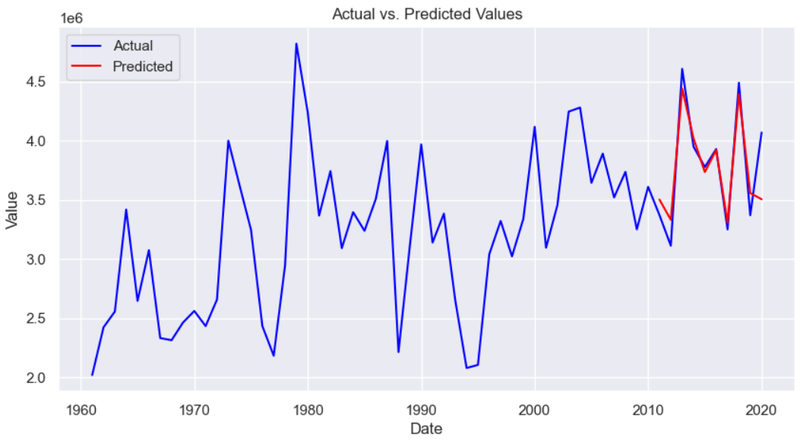

# Time Series Analysis of Spanish Wine Production 

### Authors: 
- Rodrigo Rosales Alvarez
- Arthur Trim
- Kane Smith
- Jordan Keelan
- Scott Bennett

 

Wine holds a significant role in society, not only for its taste but also as a thriving economic sector. Wine production generates billions of dollars annually, and its association with tourism further contributes to local economies by creating jobs and generating revenue. Wine also plays a social role by fostering relationships and being a part of celebrations and special occasions.

Spain stands out as one of the world's foremost wine-producing countries, ranking among the top three alongside Italy and France. In 2020, Spain produced a staggering 1,310,174 tons of wine, accounting for 16% of global wine production.

Time series analysis, a statistical and machine learning technique, proves valuable in modeling trends and predicting future values of temporal data. Techniques such as Autoregressive Integrated Moving Average (ARIMA), Seasonal ARIMA (SARIMA), Long Short-Term Memory (LSTM) networks, and Facebook Prophet can be employed to analyze and forecast crop production trends. Each method offers advantages and limitations based on data structure, model complexity, and forecasting requirements.

 

### Project Plan
1. Introduction
2. Project Dataset
3. Exploratory Data Analysis (EDA)  
4. Seasonality and Patterns  
5. Time Series Decomposition  
6. Model Development
7. Model Comparison and Selection  
8. Forecasting and Visualization  
9. Conclusion and Future Work  
10. References 

 

 

To check the code, please refer to the file [time_series_analysis.ipynb](time_series_analysis.ipynb)